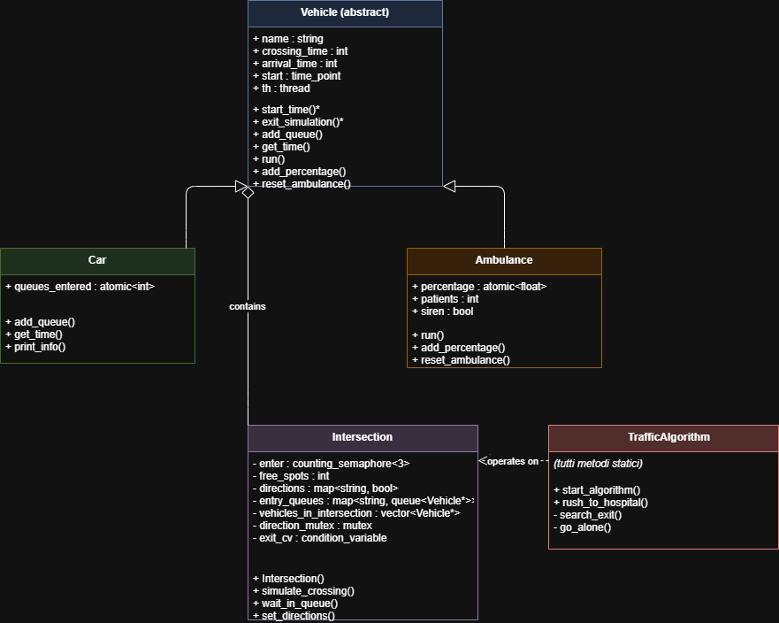

[](https://isocpp.org/)
[](https://opensource.org/licenses/MIT)
[](https://github.com/sangennaro08/multithreaded-traffic-sim-with-C-plus-plus/blob/main)
[]()

# 🚦 Traffic Simulator

A multithreaded C++ simulation where cars and ambulances navigate through a chain of intersections using real concurrency primitives — **mutexes**, **semaphores**, and **condition variables**.

> Built with C++20 · Written by a 17-year-old Italian high school student passionate about concurrent programming.

---

## 🗺️ What It Does

Multiple car threads travel sequentially through a fixed chain of intersections. Each intersection is a shared resource: vehicles compete for directional slots, queue externally when a slot is occupied, and proceed only when it is free.

**Ambulances** are created at startup but launched dynamically during the simulation based on a probability threshold. If an ambulance spends too long in transit, it enters **emergency rush mode** and bypasses all normal traffic rules.

---

## 🏗️ Project Structure

```
├── globals.hpp                  # Global state: counters, mutexes, condition variable
├── traffico.cpp                 # Entry point, simulation setup and teardown
├── Intersection.cpp/.hpp        # Intersection logic, car/ambulance init, thread management
├── Traffic_algorithm.cpp/.hpp   # Direction assignment algorithm, emergency rush logic
└── vehicles/
    ├── vehicle.hpp              # Abstract base class for all vehicles
    ├── car.hpp                  # Car implementation
    └── ambulance.hpp            # Ambulance implementation
```

---

## 📐 UML Class Diagram



**Class hierarchy:**
```
Vehicle (abstract)
├── Car
└── Ambulance
```

---

## ⚙️ Concurrency at a Glance

| Primitive | Where Used | Purpose |
|---|---|---|
| `counting_semaphore<3>` | `Intersection::enter` | Hard limit of 3 vehicles per intersection |
| `mutex` + `lock_guard` | `direction_mutex` | Protects directions, free spots, vehicles list |
| `mutex` + `lock_guard` | `print_mutex` | Serializes all console output |
| `scoped_lock` (2 mutexes) | `launch_ambulance` | Deadlock-free double acquisition |
| `condition_variable` | `wait_in_queue` | Blocks vehicle until its queue slot is free |
| `condition_variable` | `start_algorithm` | Blocks until direction assigned |
| `atomic<int/float>` | counters, percentage | Lock-free shared state |

---

## 🚀 Quick Start

**Build:**
```bash
g++ -std=c++20 Intersection.cpp Traffic_algorithm.cpp traffico.cpp -o simulator
```

**Run:**
```bash
./simulator
```

The program will prompt for the number of intersections and cars.

**On Windows / MinGW (if out-of-memory):**
```bash
g++ -std=c++20 -c Intersection.cpp -o Intersection.o
g++ -std=c++20 -c Traffic_algorithm.cpp -o Traffic_algorithm.o
g++ -std=c++20 -c traffico.cpp -o traffico.o
g++ Intersection.o Traffic_algorithm.o traffico.o -o simulator
```

**Requirements:** C++20 or later · GCC or Clang · `-pthread` on Linux

---

## 🧪 Tests

25 unit tests with [Google Test](https://github.com/google/googletest) covering `Intersection`, `Car`, `Ambulance`, and global state.

```
[==========] 25 tests from 4 test suites ran.
[  PASSED  ] 25 tests.
```

---

## 📚 Detailed Documentation

The codebase is split into focused README files — one per logical module:

| Module | Description |
|---|---|
| [📦 globals.hpp](docs/README_globals.md) | Global variables, atomics, mutexes, and condition variable |
| [🏛️ Intersection](docs/README_intersection.md) | Intersection state, semaphore, queues, enter/leave logic |
| [🚗 Vehicle / Car / Ambulance](docs/README_vehicles.md) | Class hierarchy, fields, virtual interface, timing logic |
| [🧠 Traffic Algorithm](docs/README_traffic_algorithm.md) | Direction assignment, `search_exit`, `go_alone`, emergency rush |
| [▶️ traffico.cpp](docs/README_traffico.md) | Entry point, initialization, `simulate_crossing` main loop, termination |

---

## FUNCTION POINTS BASED ON THE IFPUG METRIC

the IFPUG metric gives FP (function points) based on how many RET(classes and methods) and DET(attributes) that are visible and undertandable to the user.

```
NB: This metric does not take into account classes, methods and attributes that are used behind the scenes ONLY the one that the final user can see and interact with.
```
---
| Metric | Desciption | Involved| RET | DET | FP |
|---|---|---|---|---|---|
|ILF| Classes methods and variables visible to the final user | Vehicle(Car, Ambulance),Intersection | 3 | 13 | 7 (Low) ,7 (Low) Vehicle and Intersection are 2 different ILF so it counts to 14| 
|EIF| Files read like a sort of DB to extract and write data | None | 0 | 0 | 0 |
|EI| Menage data through inputs | set_variables() | - | - | 3 (Low) |
|EO| Ways to visualize the data AND the logic behind it | print_mutex, Traffic_algorithm.cpp | - | - | 4 (Low), 4(Low) |
|EQ| Describes data from an archive (Arrays) so they can be saw by the final user | Car::print_info, show how many Ambulances are in game | - | - | 3 (Low), 3(Low) |

| TOTAL POINTS |
|---|---|---|---|---|
| ILF | EIF | EI | EO | EQ |
| 14 | 0 | 3 | 8 | 6 |

|TOTAL FP|
|---|
|31|

---

## 👤 About Me

I'm a 17-year-old Italian high school student (4th year) passionate about C++, Java, and Python with a focus on concurrent programming. Currently also learning web development.
